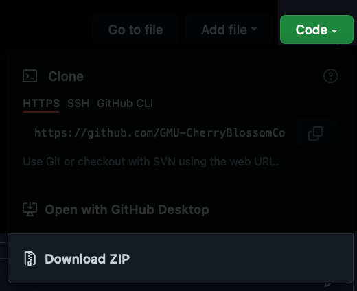
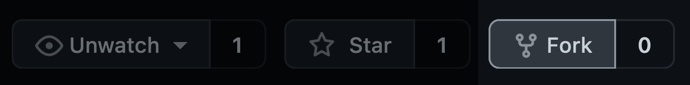
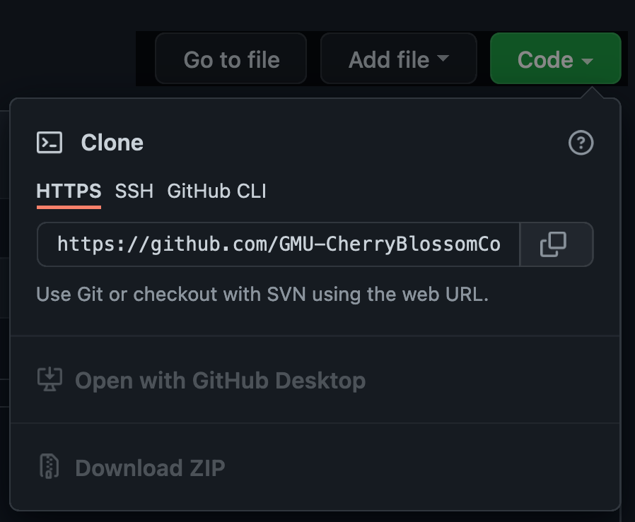

# Cherry Blossom Peak Bloom Prediction

This is the official template repository for George Mason’s Department of Statistics cherry blossom peak bloom prediction competition.

This repository contains cleaned and ready-to-use data on peak bloom dates in the *data/* folder, alongside a demo prediction analysis report (*demo_analysis.Rmd*).
The demo analysis demonstrates how to load the provided data sets, plot the observed time series, and uses a very simple linear regression model to predict the peak bloom dates for the next 10 years.
The demo analysis requires a [working installation of R](https://cran.r-project.org) (version ≥ 4.1 strongly suggested) as well as the `rmarkdown` package and the `tidyverse` suite of packages.

The rendered demo analysis is available at https://competition.statistics.gmu.edu/demo_analysis.html.

## Getting started

To start competing, you need to download the contents of this repository to your computer.
You can do so by either

a. forking this repository to your GitHub account,
b. downloading the ZIP folder



c. cloning the repository to your local computer.

If you choose options b. or c., you need to set up another publicly accessible GitHub repository (or on another hosting provider like GitLab, Bitbucket, etc.).
To submit your entry for the competition, all your code and data must be accessible in a public Git repository!

Below we provide the steps for forking this repository to your GitHub account and cloning the forked repository to your local computer.

### Prerequisites

Before you fork or clone the repository, you would need to set up Git on your system.
There are many excellent tutorials available online on how to set up Git.
The GitHub specific instructions can be found at https://docs.github.com/en/get-started/quickstart/set-up-git.

For forking, you would also need to sign up for a GitHub account.

### Forking the repository

To fork this repository, locate the _Fork_ button at the top right of the page:



This will copy the repository to your GitHub account under the name _peak-bloom-prediction_.

Next you need to clone the repository to your local computer.
Navigate to **your fork** of the repository on github.com. 
The steps are the same as outlined below for cloning the repository, **but the location of the respository will be different**.

More detailed instructions on how to fork a repository can be found under https://docs.github.com/en/get-started/quickstart/fork-a-repo.

### Cloning the repository

Whether you choose to clone this read-only repository or the forked repository under your account, you can follow these instructions to clone the repository to your local computer.

1. Above the file list of the repository on GitHub.com, locate the _Code_ button:


2. This will open a small dialog with the URLs to clone the repository.
   Copy the URL to the Git command line interface or your favorite Git client.



3. If you use a Git client, follow it's instructions on how to clone a remote repository.
   If you use the Git command line interface, open a terminal or command line window.
4. Navigate to the folder/location where you want the cloned repository.
5. Use the `git clone` command in combination with the URL from step 2.
   If you use the original repository (not a fork), you would use the following command:

```sh
$ git clone https://github.com/GMU-CherryBlossomCompetition/peak-bloom-prediction.git
```

6. Press **Enter**.
   You will see something like
```sh
#> Cloning into 'peak-bloom-prediction'...
#> remote: Enumerating objects: 10, done.
#> remote: Counting objects: 100% (10/10), done.
#> remote: Compressing objects: 100% (8/8), done.
#> remote: Total 10 (delta 0), reused 10 (delta 0), pack-reused 0
#> Receiving objects: 100% (10/10), 10.00 KiB | 5.00 MiB/s, done.
```

Now you have the repository cloned to your local computer and you can start coding away!

*Note:* this GitHub repository is read-only and if you clone it to your local computer you can make changes only on your local computer.
You will not be able to *push* your changes to this GitHub repository.
To enter the competition, you must make your repository publicly accessible!

## Competition rules

To enter the competition you must submit your predictions and the URL pointing to your repository via https://competition.statistics.gmu.edu.

**Entries must be submitted by the end of February 28, 2023 (anywhere on earth)**.
If it's February anywhere on earth, your submission will be considered.

The predictions are judged based on the sum of the absolute differences between your predicted peak bloom dates and the publicly posted peak bloom dates:

```
| predicted_bloom_date_kyoto_2023 - actual_bloom_date_kyoto_2023 | +
  | predicted_bloom_date_washingtondc_2023 - actual_bloom_date_washingtondc_2023 | +
  | predicted_bloom_date_liestal_2023 - actual_bloom_date_liestal_2023 | +
  | predicted_bloom_date_vancouver_2023 - actual_bloom_date_vancouver_2023 |
```

The true bloom dates for 2023 are taken to be the dates reported by the following agencies/institutions:

- **Kyoto (Japan):** a local news paper from Arashiyama as published at http://atmenv.envi.osakafu-u.ac.jp/aono/kyophenotemp4,
- **Washington, D.C. (USA):** National Park Service,
- **Liestal-Weideli (Switzerland):** MeteoSwiss,
- **Vancouver, BC (Canada):** Vancouver Cherry Blossom Festival in collaboration with Douglas Justice, Associate Director, Curator of Collections, UBC Botanical Garden.

The full competition rules are available under https://competition.statistics.gmu.edu.

## License


Unless otherwise noted, the content in this repository is licensed under a [Creative Commons Attribution-NonCommercial-ShareAlike 4.0 International License](http://creativecommons.org/licenses/by-nc-sa/4.0/).

For the data sets in the _data/_ folder, please see [_data/README.md_](data/README.md) for the applicable copyrights and licenses.
